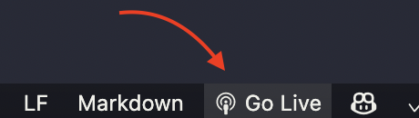

# pass the story

A collaborative effort where hack clubs and hackclubbers can build a website to tell a story together.

## To get started

Each page of the story is created in a directory under `src/pages`, and each page is added to the site by including it in an `iframe` in `src/index.html`.

1. Fork this repository and clone it locally. For more instructions, see [here](https://docs.github.com/en/get-started/quickstart/fork-a-repo). Then, open the directory in vscode.
2. Install the [Live Server extension](https://marketplace.visualstudio.com/items?itemName=ritwickdey.LiveServer). To start the live server, click "Go Live" on the status bar.  You should now see the site at https://localhost:5500.
3. You're assigned a page number. Create a directory under `src/pages` with the number you are assigned. Add an `index.html` file and any css files you need.
4. Add the page to the site by uncommenting the `section` in [`src/index.html`](https://github.com/maggie-j-liu/story/blob/main/src/index.html) that contains your page. For example, page 1 can be included by uncommenting

```html
<!--
<section>
  <iframe src="/pages/1" id="page-1"></iframe>
</section>
-->
```

by removing the `<!--` and `-->` to leave

```html
<section>
  <iframe src="/pages/1" id="page-1"></iframe>
</section>
```

5. Continue the story created by others by adding some sentences and visuals to your page. If you would like a starting point, you can copy [`templates/template.html`](https://github.com/maggie-j-liu/story/blob/main/templates/template.html) and modify it!
6. [Create a pull request](https://docs.github.com/en/pull-requests/collaborating-with-pull-requests/proposing-changes-to-your-work-with-pull-requests/creating-a-pull-request) to add your changes back to this repository.

```

```
